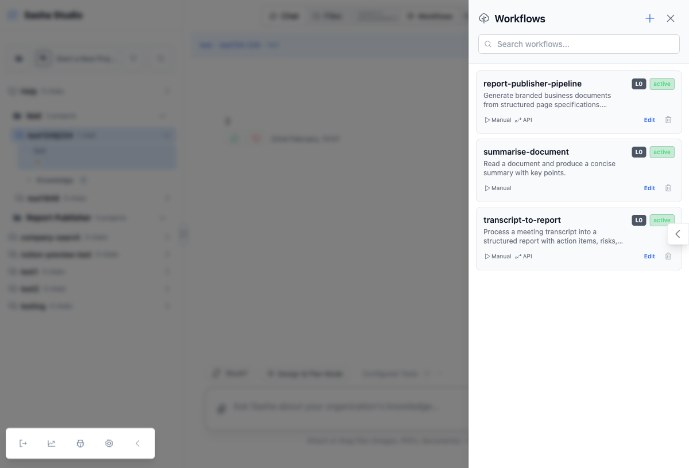
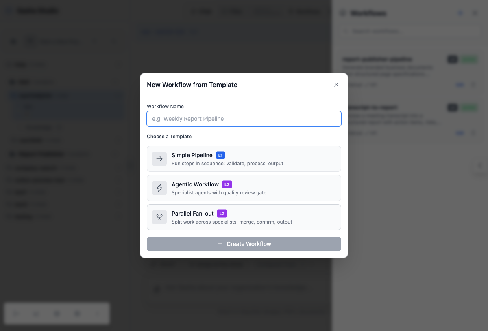
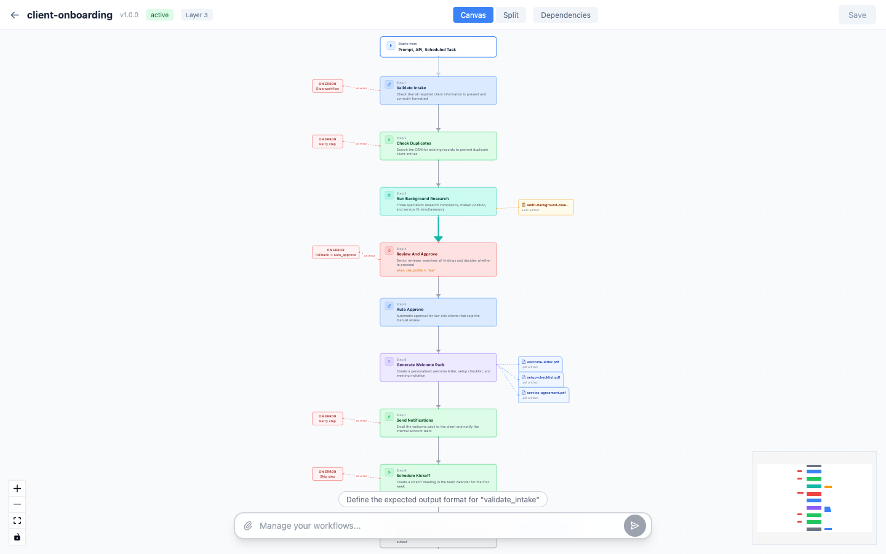
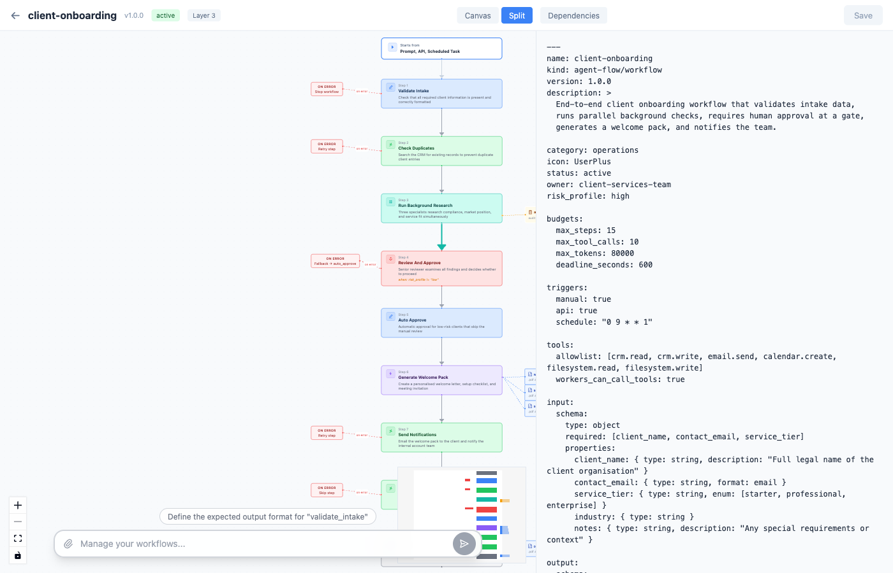
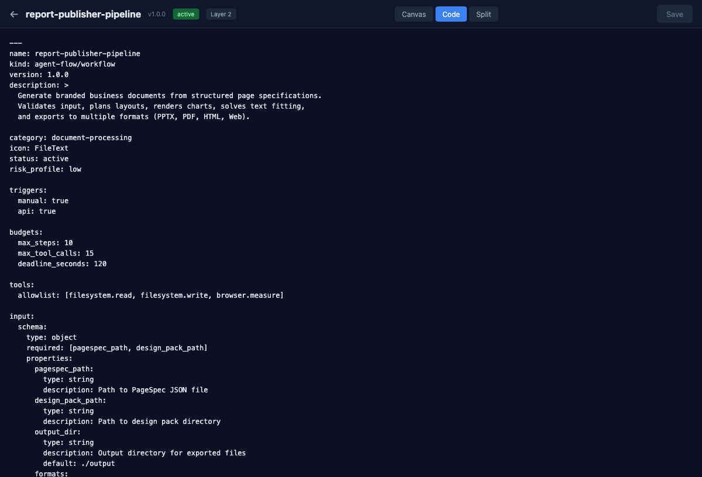

# Agent Flow

**A layered specification for agentic AI workflows.**

Structure tames LLM non-determinism. Agent Flow defines *what* happens, *when* it proceeds, and *who* does the work — while leaving the LLM free to reason creatively within each step's boundaries.

## The Problem

LLMs are non-deterministic by nature — the same prompt can produce different outputs every time. This is their strength (creativity, reasoning, adaptation) and their weakness (unpredictability, inconsistency, hallucination).

Current approaches either ignore this or try to force determinism, losing what makes LLMs valuable.

## The Solution

Agent Flow applies **structural guardrails** around non-deterministic steps:

| Layer | What's deterministic | What's non-deterministic |
|-------|---------------------|------------------------|
| **Steps** | Order, dependencies, data flow | LLM reasoning within each step |
| **Budgets** | Token limits, time limits, step caps | How the LLM uses its budget |
| **Gates** | When approval is required, who approves | What the reviewer decides |
| **Agents** | Role, tools, output format | How the agent fulfills its role |
| **Audit** | What gets logged, reason codes | — (fully deterministic) |

## Design Principles

1. **Business-friendly first** — A product manager can read and modify a workflow without engineering help
2. **Markdown-native** — Plain text files, version-controlled, diffable, no special tooling required
3. **Layered complexity** — Start simple, add sophistication only when needed
4. **Structure tames chaos** — Budgets, gates, validation, and stop conditions prevent runaway agents
5. **Observable by default** — Every run produces a verifiable audit trail
6. **Backward compatible** — Every valid skill file is a valid Agent Flow workflow (single-step)

## Layers

Agent Flow is a **strict superset** of the [Agent Skills Spec](https://github.com/anthropics/agent-skills-spec). Complexity is opt-in:

| Layer | Audience | What it adds |
|-------|----------|-------------|
| **0 — Skill** | Everyone | A valid SKILL.md with `name`/`description`. One implicit step. |
| **1 — Linear** | Skill authors | Ordered step blocks. Sequential pipeline. |
| **2 — Graph** | Builders | Conditions, parallel bundles, branching. DAG execution. |
| **3 — Long-running** | Platform teams | Checkpoints, waitpoints, signals. Resumable workflows. |

## Quick Example

```yaml
---
name: transcript-to-report
kind: agent-flow/workflow
version: 1.0.0
description: Convert meeting transcript into structured report with actions and risks

budgets:
  max_steps: 10
  max_tokens: 40000
  deadline_seconds: 300
---
```

# Purpose

Turn raw meeting transcripts into structured, actionable reports.

## Steps

```step
id: validate
type: transform
description: Check transcript has required fields
reads: [input]
writes: [state.validated]
on_error: stop
```

```step
id: extract
type: parallel
description: Three specialists extract actions, risks, and themes simultaneously
reads: [state.validated]
writes: [state.extracted]
bundle: extract_pack
```

```step
id: review
type: gate
description: Quality check before final assembly
reads: [state.extracted]
writes: [state.reviewed]
```

```step
id: assemble
type: skill
description: Combine into final report
reads: [state.reviewed]
writes: [output]
```

Workflows are self-contained — trigger configuration lives in the frontmatter too:

```yaml
triggers:
  schedule: "0 6 * * 1"    # run weekly on Monday at 6am
  manual: true              # can be run on demand
  api: true                 # can be triggered via API
```

Two concepts, not three: **Workflow** (the file) and **Execution** (a run). No separate "task" or "schedule" record needed.

See the [full specification](SPEC.md) for complete details, step types, agent definitions, bundle configuration, and more.

## Recommended Patterns

| Pattern | Structure | Use Case |
|---------|-----------|----------|
| **Simple Pipeline** | validate → process → output | Scheduled reports, data extraction |
| **Agentic Workflow** | validate → specialist → QA gate → assemble | Analysis, content creation, research |
| **Parallel Fan-out** | validate → fan-out → merge → confirm → output | Multi-perspective analysis, document processing |

See the [examples/](examples/) directory for complete implementations of each pattern.

## Agent Flow in Practice

Agent Flow isn't just a spec on paper — it has a working visual editor in [Sasha Studio](https://github.com/context-is-everything/sasha-ai-knowledge-management). The screenshots below show how the three recommended patterns come to life.

### Managing Workflows

The workflow manager lists all Agent Flow files with their metadata at a glance: layer badge, active/draft status, trigger types (Manual, API, Schedule), and one-click editing. Workflows are plain markdown files — what you see here maps directly to frontmatter fields in the spec.



### Creating from Templates

New workflows start from one of three templates matching the recommended patterns. Each template generates a complete Agent Flow file with frontmatter, steps, agents, and observability — ready to customize.

- **Simple Pipeline (Layer 1)** — Sequential steps: validate, process, output
- **Agentic Workflow (Layer 2)** — Specialist agents with a quality review gate
- **Parallel Fan-out (Layer 2)** — Split work across multiple agents, merge results, confirm



### Visual Workflow Editor — Canvas View

The canvas renders each `step` block as a node in a directed graph. Nodes are color-coded by step type:

- **Blue** — `transform` steps (validate, filter, format)
- **Green** — `tool` steps (external integrations, file I/O)
- **Teal** — `parallel` steps (fan-out to worker bundles)

Edges show the execution flow. Conditional edges (like `on_error: fallback`) are labelled so you can see branching logic at a glance. This is the `report-publisher-pipeline` example — a 9-step Layer 2 workflow with conditional fallback paths.



### Split View — Canvas + Code Side by Side

The split view shows the visual graph alongside the raw markdown. Every frontmatter field, step block, and agent definition from the spec is visible in the code pane. Edit either side — they stay in sync.

This is the view a product manager uses to understand what the workflow does (canvas) while an engineer tweaks the details (code).



### Code View — The Spec as Written

The code view shows the full Agent Flow file: YAML frontmatter (name, kind, version, description, triggers, budgets, tool permissions, input/output schemas) followed by markdown step definitions. This is the actual file on disk — no abstraction layer, no proprietary format.



## Standards We Build On

Agent Flow borrows proven concepts from established standards:

- **[BPMN 2.0](https://www.omg.org/spec/BPMN/2.0/)** — Gateway types for branching (exclusive, parallel, inclusive)
- **[Temporal.io](https://temporal.io/)** — Activity/retry semantics, signals for external events
- **[AWS Step Functions](https://docs.aws.amazon.com/step-functions/)** — Choice/Parallel/Map state types, Catch/Retry model
- **[LangGraph](https://github.com/langchain-ai/langgraph)** — Typed state with reads/writes, conditional edges, checkpoint-based pause/resume
- **[CrewAI](https://github.com/crewAIInc/crewAI)** — Agent persona model (role, goal, tools, expected output)
- **[OpenTelemetry](https://opentelemetry.io/)** — Span model, semantic conventions for trace attributes
- **[JSON Schema](https://json-schema.org/)** — Input/output schema definitions

## Repository Structure

```
sasha-workflow/
├── SPEC.md              # The full specification
├── spec/
│   ├── schema.json      # JSON Schema for validating workflow files
│   └── conventions.md   # Standard reason codes, event types
├── examples/
│   ├── transcript-to-report.md      # Agentic: parallel extraction + QA
│   ├── document-creation.md         # Long-running: drafting + approval gate
│   ├── report-publisher-pipeline.md # Deterministic: multi-format export
│   └── simple-skill.md              # Layer 0: plain skill as workflow
└── README.md
```

## Status

**Spec version: 0.2.0 (Draft)** — This specification is a draft proposal. We welcome feedback via [issues](https://github.com/context-is-everything/sasha-workflow/issues) and [discussions](https://github.com/context-is-everything/sasha-workflow/discussions).

## License

MIT
