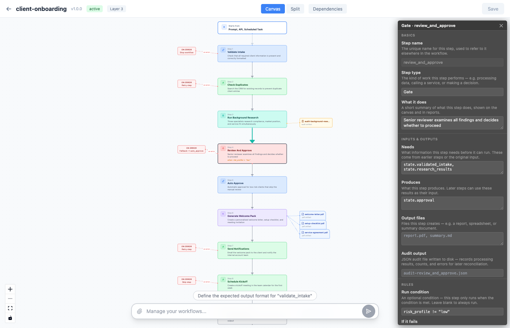
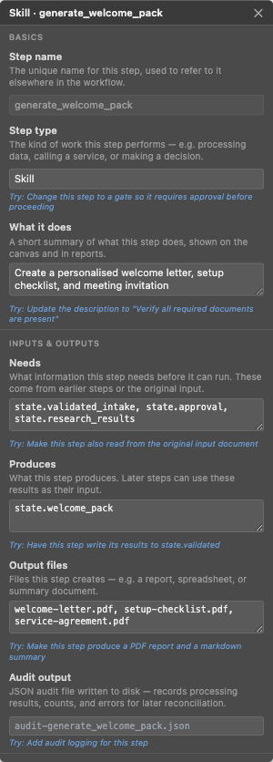
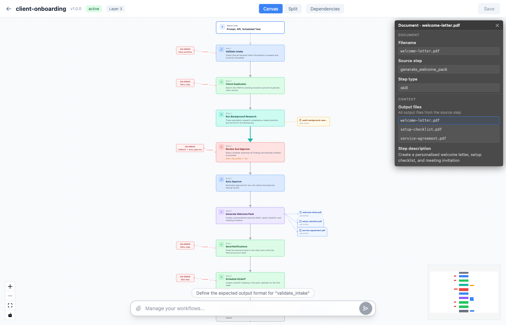
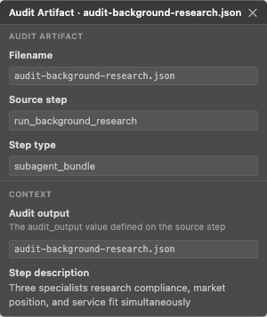
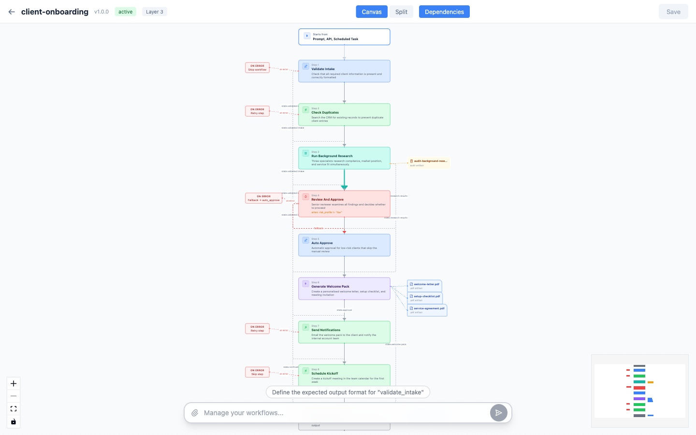

# Agent Flow

**Design AI workflows visually. Edit them conversationally. Run them with enterprise controls.**

Agent Flow is a layered specification for agentic AI workflows. It defines *what* happens, *when* it proceeds, and *who* does the work — while leaving the AI free to reason creatively within each step's boundaries.

The visual editor in [Sasha Studio](https://github.com/context-is-everything/sasha-ai-knowledge-management) makes the full specification accessible to anyone. Read a process as a graph, change it by typing a sentence.


## Why Agent Flow

LLMs are non-deterministic — the same prompt can produce different outputs every time. This is their strength (creativity, reasoning, adaptation) and their weakness (unpredictability, inconsistency, hallucination).

Agent Flow applies **structural guardrails** around non-deterministic steps:

| Layer | What's deterministic | What's non-deterministic |
|-------|---------------------|------------------------|
| **Steps** | Order, dependencies, data flow | LLM reasoning within each step |
| **Budgets** | Token limits, time limits, step caps | How the LLM uses its budget |
| **Gates** | When approval is required, who approves | What the reviewer decides |
| **Agents** | Role, tools, output format | How the agent fulfills its role |
| **Audit** | What gets logged, reason codes | — (fully deterministic) |

### Design Principles

1. **Business-friendly first** — A product manager can read and modify a workflow without engineering help
2. **Markdown-native** — Plain text files, version-controlled, diffable, no special tooling required
3. **Layered complexity** — Start simple, add sophistication only when needed
4. **Structure tames chaos** — Budgets, gates, validation, and stop conditions prevent runaway agents
5. **Observable by default** — Every run produces a verifiable audit trail
6. **Backward compatible** — Every valid skill file is a valid Agent Flow workflow (single-step)

---

## Visual Editor Guide

The workflow editor in Sasha Studio provides two first-class interaction modes: a **visual canvas** for reading and understanding workflows as directed graphs, and a **chat bar** for modifying anything by describing what you want in plain English.

Every screenshot below shows the `client-onboarding` example — a full Layer 3 workflow with 9 steps, 4 agents, parallel bundles, approval gates, output files, audit artifacts, and error handling.

### Managing Workflows

The workflow manager lists all Agent Flow files at a glance. Each card shows the layer badge, active/draft status, and trigger types (Manual, API, Schedule). Click **Edit** to open the visual editor.

Workflows are plain markdown files — what you see here maps directly to frontmatter fields in the spec.


### Creating from Templates

New workflows start from one of three templates matching the recommended patterns. Each template generates a complete Agent Flow file with frontmatter, steps, agents, and observability — ready to customize.

- **Simple Pipeline (Layer 1)** — Sequential steps: validate, process, output
- **Agentic Workflow (Layer 2)** — Specialist agents with a quality review gate
- **Parallel Fan-out (Layer 2)** — Split work across multiple agents, merge results, confirm


### Canvas View

The canvas renders each `step` block as a node in a directed graph. Nodes are connected by edges showing execution order, and the layout reads top-to-bottom like a flowchart.

The full `client-onboarding` workflow is shown below — 9 steps from intake validation through to final onboarding summary, with artifact nodes branching right, error handlers branching left, and an audit trail node for the parallel research step.

#### Node Types

Every spec concept has a distinct visual representation:

| Node | Represents | Spec field |
|------|-----------|------------|
|  | How the workflow starts | `triggers:` frontmatter |
|  | Parallel subagent execution | `type: subagent_bundle` |
|  | Approval checkpoint with conditions | `type: gate` + `when:` |
|  | AI specialist delegation | `type: skill` |
|  | Output file produced by a step | `output_files:` |
|  | JSON audit trail | `audit_output:` |
|  | Error handling path | `on_error:` |

Nodes are color-coded by step type: blue for `transform`, green for `tool`, teal for `subagent_bundle`, coral for `gate`, indigo for `skill`, and dark gray for `end`. Artifact nodes branch off to the right of their source step, and error handlers branch to the left with dashed red connectors.

### Step Inspector

Click any step node to open the property inspector. Every field from the spec's step definition is editable — type, description, reads/writes, output files, audit output, error handling, run conditions, agent assignment, expected output, and reason codes.

Each field includes a **chat hint** — a clickable suggestion that populates the chat bar with a natural language instruction. This bridges the visual editor and conversational editing: see a field, click the hint, and the AI makes the change for you.



<details>
<summary>Inspector panel detail</summary>



The inspector is organized into sections that mirror the spec structure:
- **Basics** — Step name, type, description
- **Inputs & Outputs** — `reads`, `writes`, `output_files`, `audit_output`
- **Rules** — `when` condition, `on_error` handling, `fallback`, `retry`, `stop_condition`
- **AI Behaviour** — `expected_output`, `agent`, `gate_method`, `tool`, `bundle`
- **Tracking** — `reason_code`, `reason_code_on_fail`

</details>

### Artifact Inspector

Click an artifact or audit node to inspect it. The artifact inspector shows the filename, source step, step type, and lists all output files from that step — with the selected file highlighted.



### Audit Artifact Inspector

Audit artifacts represent the `audit_output` field from the spec. Clicking one shows the JSON filename, the source step, and the step description — making it easy to trace which step produces which audit record.



### Dependencies View

Toggle the **Dependencies** button to overlay implicit data-flow edges derived from `reads`/`writes` declarations. These dashed lines show which steps depend on data produced by earlier steps — even when they aren't adjacent in the execution order. Fallback edges are shown as red dashed lines.

This view answers "where does this data come from?" and "what breaks if I remove this step?" at a glance.



### Split View — Canvas + Code Side by Side

The split view shows the visual graph alongside the raw markdown. Every frontmatter field, step block, and agent definition from the spec is visible in the code pane.

This is the view where a product manager reads what the workflow does (canvas) while an engineer tweaks the details (code). Edit either side — they stay in sync.


### Workflow Chat

The floating chat bar at the bottom of the editor lets you modify workflows conversationally. Type natural language instructions and the AI updates the workflow markdown, which immediately re-renders on the canvas.

The chat bar also **suggests edits** based on what's missing from your workflow — if there's no error handling, no quality gate, or steps without expected output definitions, it will prompt you with a clickable suggestion chip.


---

## Edit Workflows with Natural Language

Agent Flow files have enterprise-grade process controls under the hood — gates, audit trails, parallel orchestration, budgets, retry logic — but the editing experience is conversational. The same file that enforces compliance gates and audit logging can be modified by typing a sentence:

| What you want | What you type |
|---------------|---------------|
| Add a quality check | *"Add a human review gate after the extraction step"* |
| Handle failures gracefully | *"Add retry with 3 attempts and exponential backoff to the API call"* |
| Run on a schedule | *"Schedule this to run every Monday at 6am Eastern"* |
| Split work across specialists | *"Fan out the analysis to financial, legal, and technical reviewers in parallel"* |
| Set resource limits | *"Add a budget of 50k tokens and a 5 minute deadline"* |
| Track outcomes | *"Add reason codes: REPORT_APPROVED on success, REPORT_REJECTED on failure"* |
| Make steps conditional | *"Only run the enrichment step when the risk score is high"* |
| Add audit logging | *"Enable full audit logging with PII redaction"* |
| Define what the AI produces | *"Set the expected output to a JSON object with summary, risk_score, and recommendations"* |
| Create output documents | *"Have this step produce a PDF report and a markdown summary"* |

---

## The Specification

### Layers

Agent Flow is a **strict superset** of the [Agent Skills Spec](https://github.com/anthropics/agent-skills-spec). Complexity is opt-in:

| Layer | Audience | What it adds |
|-------|----------|-------------|
| **0 — Skill** | Everyone | A valid SKILL.md with `name`/`description`. One implicit step. |
| **1 — Linear** | Skill authors | Ordered step blocks. Sequential pipeline. |
| **2 — Graph** | Builders | Conditions, parallel bundles, branching. DAG execution. |
| **3 — Long-running** | Platform teams | Checkpoints, waitpoints, signals. Resumable workflows. |

### Quick Example

```yaml
---
name: transcript-to-report
kind: agent-flow/workflow
version: 1.0.0
description: Convert meeting transcript into structured report with actions and risks

budgets:
  max_steps: 10
  max_tokens: 40000
  deadline_seconds: 300
---
```

# Purpose

Turn raw meeting transcripts into structured, actionable reports.

## Steps

```step
id: validate
type: transform
description: Check transcript has required fields
reads: [input]
writes: [state.validated]
on_error: stop
```

```step
id: extract
type: parallel
description: Three specialists extract actions, risks, and themes simultaneously
reads: [state.validated]
writes: [state.extracted]
bundle: extract_pack
```

```step
id: review
type: gate
description: Quality check before final assembly
reads: [state.extracted]
writes: [state.reviewed]
```

```step
id: assemble
type: skill
description: Combine into final report
reads: [state.reviewed]
writes: [output]
```

Workflows are self-contained — trigger configuration lives in the frontmatter too:

```yaml
triggers:
  schedule: "0 6 * * 1"    # run weekly on Monday at 6am
  manual: true              # can be run on demand
  api: true                 # can be triggered via API
```

Two concepts, not three: **Workflow** (the file) and **Execution** (a run). No separate "task" or "schedule" record needed.

See the [full specification](SPEC.md) for complete details, step types, agent definitions, bundle configuration, and more.

### Recommended Patterns

| Pattern | Structure | Use Case |
|---------|-----------|----------|
| **Simple Pipeline** | validate → process → output | Scheduled reports, data extraction |
| **Agentic Workflow** | validate → specialist → QA gate → assemble | Analysis, content creation, research |
| **Parallel Fan-out** | validate → fan-out → merge → confirm → output | Multi-perspective analysis, document processing |

See the [examples/](examples/) directory for complete implementations of each pattern.

---

## Standards We Build On

Agent Flow borrows proven concepts from established standards:

- **[BPMN 2.0](https://www.omg.org/spec/BPMN/2.0/)** — Gateway types for branching (exclusive, parallel, inclusive)
- **[Temporal.io](https://temporal.io/)** — Activity/retry semantics, signals for external events
- **[AWS Step Functions](https://docs.aws.amazon.com/step-functions/)** — Choice/Parallel/Map state types, Catch/Retry model
- **[LangGraph](https://github.com/langchain-ai/langgraph)** — Typed state with reads/writes, conditional edges, checkpoint-based pause/resume
- **[CrewAI](https://github.com/crewAIInc/crewAI)** — Agent persona model (role, goal, tools, expected output)
- **[OpenTelemetry](https://opentelemetry.io/)** — Span model, semantic conventions for trace attributes
- **[JSON Schema](https://json-schema.org/)** — Input/output schema definitions

## Repository Structure

```
sasha-workflow/
├── SPEC.md              # The full specification
├── spec/
│   ├── schema.json      # JSON Schema for validating workflow files
│   └── conventions.md   # Standard reason codes, event types
├── examples/
│   ├── transcript-to-report.md      # Agentic: parallel extraction + QA
│   ├── document-creation.md         # Long-running: drafting + approval gate
│   ├── report-publisher-pipeline.md # Deterministic: multi-format export
│   ├── client-onboarding.md         # Full-featured: v0.2.0 showcase with all new fields
│   └── simple-skill.md              # Layer 0: plain skill as workflow
├── docs/
│   └── screenshots/     # Visual editor screenshots from Sasha Studio
└── README.md
```

## Status

**Spec version: 0.2.0 (Draft)** — This specification is a draft proposal. We welcome feedback via [issues](https://github.com/context-is-everything/sasha-workflow/issues) and [discussions](https://github.com/context-is-everything/sasha-workflow/discussions).

## License

MIT
